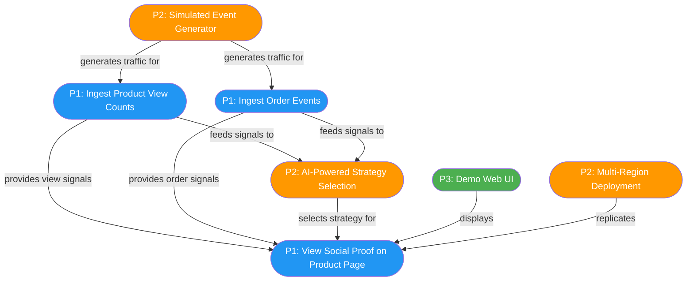
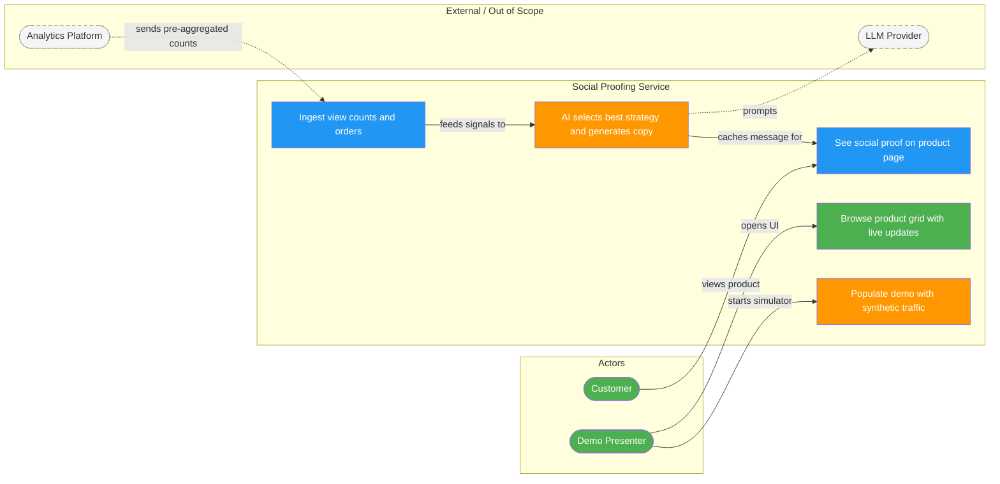
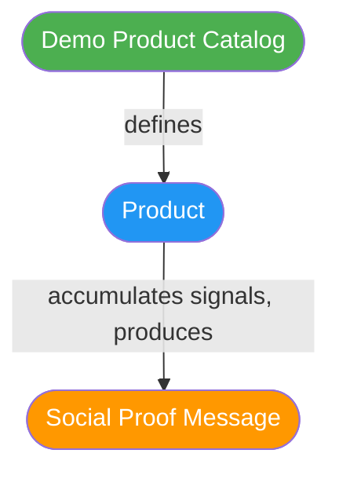
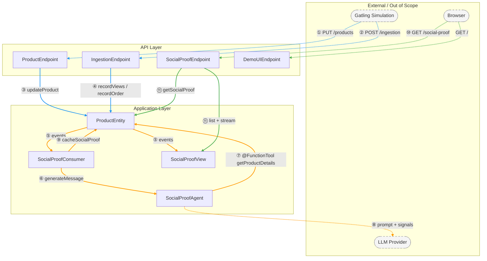
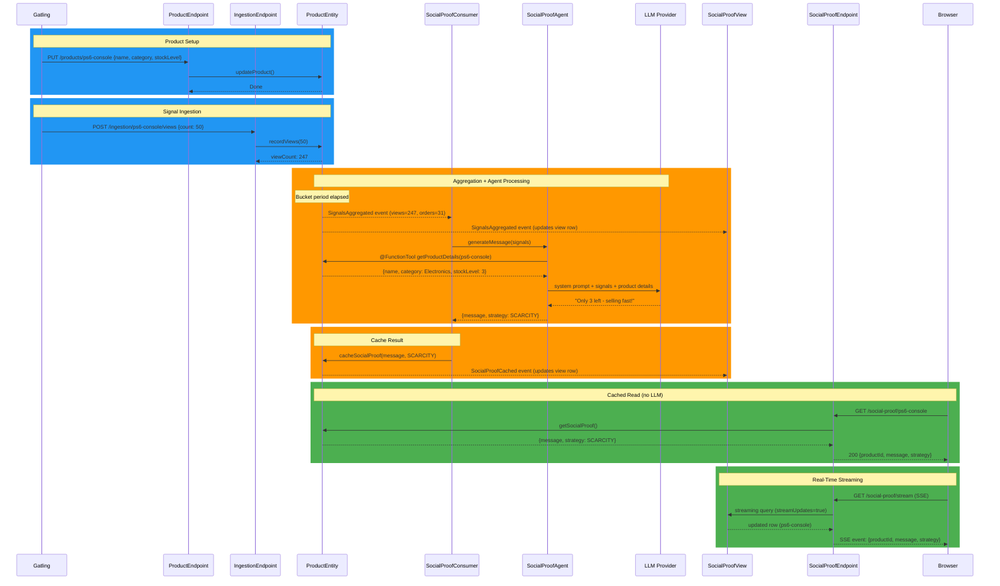

# Social Proofing Agent

An AI-powered social proofing service built on Akka SDK. Generates contextual social proof messages for retail product pages (e.g., "47 people are viewing this right now", "Bought 12 times in the last hour") using an AI agent that selects the most effective strategy based on real-time signals.

The service tracks pre-aggregated view counts and order events, periodically triggers an AI agent to select the best social proof strategy (urgency, validation, scarcity, or trending), and serves pre-computed cached messages with no LLM on the read path.

## Quick Start

```bash
# Set your Gemini API key
export GOOGLE_AI_GEMINI_API_KEY=your-key-here

# Compile and run
mvn compile exec:java
```

Open http://localhost:9000/ to see the demo UI. Use the gear icon at the bottom to add products and send events.

Verify the API:

```bash
# Create a product
curl -X PUT http://localhost:9000/products/ps6-console \
  -H "Content-Type: application/json" \
  -d '{"name": "PlayStation 6", "category": "Electronics & Tech", "stockLevel": 3}'

# Send views
curl -X POST http://localhost:9000/ingestion/ps6-console/views \
  -H "Content-Type: application/json" \
  -d '{"count": 50}'

# Get social proof (after aggregation period)
curl http://localhost:9000/social-proof/ps6-console
```

## Usage

### Product Endpoint

**PUT /products/{productId}** — Create or update product catalog info

```bash
curl -X PUT http://localhost:9000/products/ps6-console \
  -H "Content-Type: application/json" \
  -d '{"name": "PlayStation 6", "category": "Electronics & Tech", "stockLevel": 3}'
```

```json
{"productId": "ps6-console", "name": "PlayStation 6", "category": "Electronics & Tech", "stockLevel": 3}
```

### Ingestion Endpoint

**POST /ingestion/{productId}/views** — Record a batch of product views

```bash
curl -X POST http://localhost:9000/ingestion/ps6-console/views \
  -H "Content-Type: application/json" \
  -d '{"count": 47}'
```

```json
{"viewCount": 142}
```

**POST /ingestion/{productId}/orders** — Record a product order

```bash
curl -X POST http://localhost:9000/ingestion/ps6-console/orders \
  -H "Content-Type: application/json" \
  -d '{}'
```

```json
{"orderCount": 12}
```

### Social Proof Endpoint

**GET /social-proof/{productId}** — Get pre-computed social proof message

```bash
curl http://localhost:9000/social-proof/ps6-console
```

```json
{"productId": "ps6-console", "message": "Only 3 left — selling fast!", "strategy": "SCARCITY", "generatedAt": "2026-04-10T14:30:00Z"}
```

**GET /social-proof/products** — List all products with social proof

```bash
curl http://localhost:9000/social-proof/products
```

**GET /social-proof/stream** — SSE stream of social proof updates

```bash
curl http://localhost:9000/social-proof/stream
```

### Demo UI

Open http://localhost:9000/ in a browser. The main view shows a product grid with live social proof messages updated via SSE. Click the gear icon to access administration (add products, send events).

### Traffic Simulation (Gatling)

Generate realistic traffic across 4 demo products with varying profiles (hot, medium, cold). Designed to stay within Gemini 2.0 Flash free tier rate limits (15 RPM). Requires the service to be running.

```bash
# Start the service first, then in a separate terminal:
mvn gatling:test
```

The simulation runs three phases:
1. **Warm-up** — creates 4 products via PUT and sends an initial burst of views/orders
2. **Steady state** — continuous traffic at ~10 events/sec for 60 seconds
3. **Peak burst** — simulates a product launch (PS6 goes viral)

To target a deployed service instead of localhost:

```bash
mvn gatling:test -DbaseUrl=https://your-service.akka.app
```

### Load Testing (Throughput Validation)

Validates throughput requirements with individual view events (count=1) at high rates. Use the stub model provider to avoid LLM rate limits and costs:

```bash
# Start service with stub model (no LLM calls)
MODEL_PROVIDER=stub mvn compile exec:java

# Run load test (in separate terminal)
mvn gatling:test -Dgatling.simulationClass=com.example.socialproofing.simulation.LoadTestSimulation
```

Phases:
1. **Setup** — creates 100 products
2. **Sustained write** — 500 req/sec for 30 seconds
3. **Peak write burst** — ramps to 5,000 req/sec for 10 seconds
4. **Sustained read** — 700 req/sec for 30 seconds
5. **Peak read** — ramps to 3,000 req/sec for 10 seconds

All rates are configurable via `-D` params for scaling up on cloud:

```bash
mvn gatling:test -Dgatling.simulationClass=com.example.socialproofing.simulation.LoadTestSimulation \
  -DbaseUrl=https://your-service.akka.app \
  -DproductCount=1000 \
  -DwriteRate=500 \
  -DpeakWriteRate=50000 \
  -DreadRate=700 \
  -DpeakReadRate=7000
```

Assertions: p95 < 500ms, >99% success rate. In-memory throttling (`PERSIST_INTERVAL`) keeps journal writes bounded regardless of ingestion rate.

### Configuration

All settings have defaults in `application.conf` and can be overridden via environment variables.

| Env Var | Default | Description |
|---------|---------|-------------|
| `MODEL_PROVIDER` | `googleai-gemini` | Model provider — set to `stub` for load testing |
| `GOOGLE_AI_GEMINI_API_KEY` | — | Google Gemini API key |
| `GEMINI_MODEL_NAME` | `gemini-2.5-flash-lite` | Gemini model to use |
| `GEMINI_MAX_RETRIES` | `0` | Retry count on model failure |
| `STUB_DELAY_MS` | `50` | Simulated processing delay for stub model (ms) |
| `PERSIST_INTERVAL` | `5s` | How often to flush in-memory counters to journal |
| `AGENT_TRIGGER_INTERVAL` | `15s` | How often to trigger the AI agent with aggregated signals |
| `MIN_VIEWS` | `1` | Minimum view count before social proof is shown |
| `MIN_ORDERS` | `0` | Minimum order count before social proof is shown |

> **Stub model provider:** Set `MODEL_PROVIDER=stub` to replace the LLM with a deterministic stub that returns fixed social proof messages after a configurable delay (`STUB_DELAY_MS`). This is useful for load testing and local development without a Gemini API key or rate limit concerns. No `GOOGLE_AI_GEMINI_API_KEY` is needed when using the stub provider.

## Architecture

### Components

| Component | Type | Responsibility |
|-----------|------|----------------|
| ProductEntity | Event Sourced Entity | Tracks view/order counters, stores cached social proof (~920 bytes per product) |
| SocialProofAgent | Agent | Selects strategy (urgency/validation/scarcity/trending) and generates copy via Gemini |
| SocialProofConsumer | Consumer | Reacts to SignalsAggregated events, triggers agent, caches result |
| SocialProofView | View | Projects products for listing and SSE streaming (streamUpdates) |
| ProductEndpoint | HTTP Endpoint | PUT /products — catalog management |
| IngestionEndpoint | HTTP Endpoint | POST /ingestion — view counts and orders |
| SocialProofEndpoint | HTTP Endpoint | GET /social-proof — cached messages, product list, SSE stream |
| DemoUIEndpoint | HTTP Endpoint | Serves static demo UI |

### How It Works

1. **Ingest**: View counts and orders arrive via HTTP and accumulate in the ProductEntity
2. **Aggregate**: When the bucket period elapses, the entity emits a `SignalsAggregated` event with current counters, then rotates (current becomes previous, current resets to zero)
3. **Generate**: The SocialProofConsumer picks up the aggregation event, calls the AI agent with the signals
4. **Cache**: The agent selects a strategy, generates copy, and the result is cached in the entity
5. **Serve**: Product page reads the cached message directly from the entity — no LLM call on the read path
6. **Stream**: The SocialProofView projects all updates and streams them to the UI via SSE

### Data Model

- **ProductState**: productId, name, category, stockLevel, currentViewCount, previousViewCount, currentOrderCount, previousOrderCount, cachedMessage, lastAggregatedAt, recentViewKeys, recentOrderKeys
- **ProductSignals**: productId, viewCount, orderCount, trendDirection, trendMultiplier
- **CachedSocialProof**: message, strategy, generatedAt
- **Strategy**: URGENCY, VALIDATION, SCARCITY, TRENDING, NONE

### Diagrams

#### User Journey Map



#### Actor-Goal Overview



#### Entity Relationship Map



#### Component Dependencies



#### Sequence Diagram



### Design Decisions

| Decision | Rationale |
|----------|-----------|
| Counter-based state (not time-bucketed lists) | Bounded state size (~920 bytes per product) regardless of traffic volume |
| Aggregation-triggered agent (not event-triggered) | Prevents excessive LLM calls during high-throughput ingestion |
| Cache in entity state (not separate cache) | Simplest approach — entity already holds signals, no extra component |
| Gatling for traffic simulation (not in-service generator) | Keeps service code focused on business logic, same simulation for demo + load testing |
| ProductEntity as agent @FunctionTool | Agent fetches catalog data (category, stock) from entity directly |
| Idempotency keys (last 10 per type) | Deduplication for retries without unbounded state growth |

## Testing

```bash
# Unit tests
mvn test

# Unit + integration tests
mvn verify
```

## Deployment

### Prerequisites

Create the `app-secret` with your configuration. Only `GOOGLE_AI_GEMINI_API_KEY` is required; all others are optional and fall back to defaults in `application.conf`.

```bash
# Create secret with API key (and optionally override any defaults)
akka secret create generic app-secret \
  --literal GOOGLE_AI_GEMINI_API_KEY=your-key-here \
  --literal MODEL_PROVIDER=googleai-gemini \
  --literal GEMINI_MODEL_NAME=gemini-2.5-flash-lite \
  --literal GEMINI_MAX_RETRIES=0 \
  --literal STUB_DELAY_MS=500 \
  --literal PERSIST_INTERVAL=5s \
  --literal AGENT_TRIGGER_INTERVAL=15s \
  --literal MIN_VIEWS=1 \
  --literal MIN_ORDERS=0
```

Only `GOOGLE_AI_GEMINI_API_KEY` is required; remove any `--literal` lines you don't need to override.

### Build and Deploy

```bash
# Build container image
mvn clean install -DskipTests

# Deploy using service descriptor (pushes image and applies config)
akka project apply -f service.yaml --push
```

To deploy with the CLI directly instead:

```bash
akka service deploy social-proofing-agent social-proofing-agent:tag-name --push \
  --secret-env GOOGLE_AI_GEMINI_API_KEY=app-secret/GOOGLE_AI_GEMINI_API_KEY
```

Refer to [Deploy and manage services](https://doc.akka.io/operations/services/deploy-service.html) for more information.

## Project Structure

```text
src/main/java/com/example/socialproofing/
├── domain/
│   ├── ProductState.java            # State: current/previous counters, cached message
│   ├── ProductEvent.java            # Events: ViewsRecorded, OrderRecorded, SignalsAggregated, SocialProofCached
│   └── CachedSocialProof.java       # Cached message record
├── application/
│   ├── ProductEntity.java           # ESE: signal aggregation + cached message storage
│   ├── SocialProofAgent.java        # AI agent: strategy selection + copy generation
│   ├── SocialProofConsumer.java     # Consumer: reacts to aggregation, triggers agent
│   └── SocialProofView.java         # View: product listing + SSE streaming
├── api/
│   ├── ProductEndpoint.java         # PUT /products
│   ├── IngestionEndpoint.java       # POST /ingestion
│   ├── SocialProofEndpoint.java     # GET /social-proof
│   └── DemoUIEndpoint.java          # Serves static UI

src/test/java/com/example/socialproofing/
├── domain/ProductStateTest.java
├── application/ProductEntityTest.java
├── application/SocialProofAgentTest.java
├── api/IngestionEndpointIntegrationTest.java
├── api/SocialProofEndpointIntegrationTest.java
└── simulation/SocialProofSimulation.java   # Gatling traffic simulation
```
